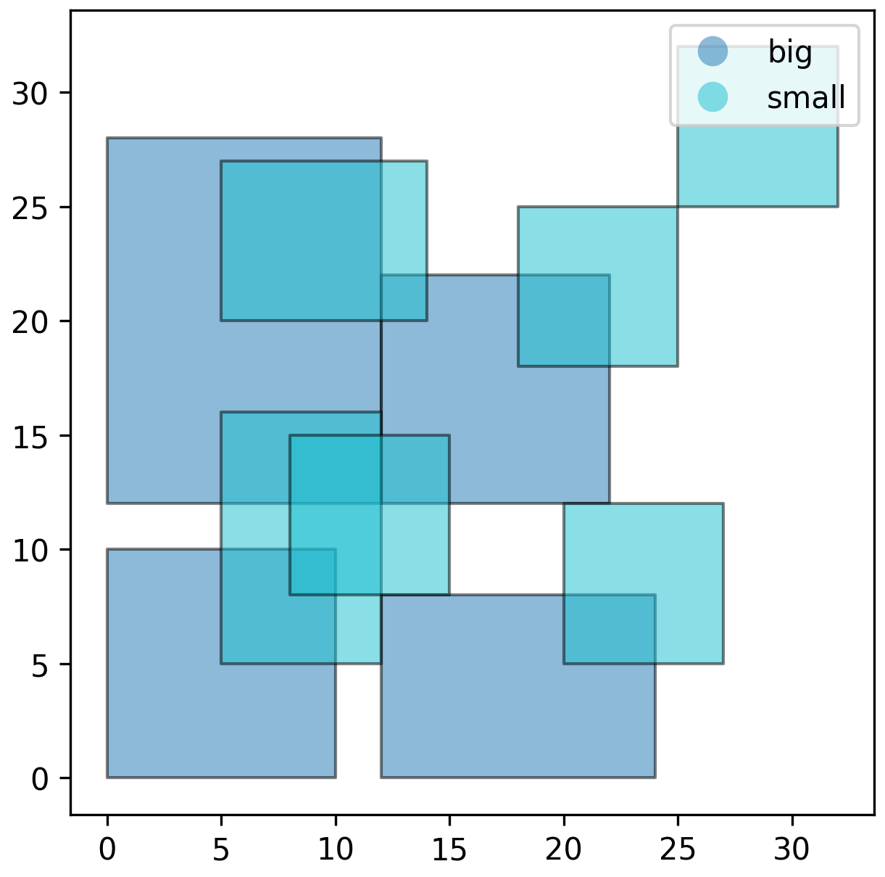

# User Guide
## Input Data

UrbanOPT requires input data in the form of a GeoDataFrame with the following columns:

| Column | Type | Description |
|--------|------|-------------|
| `pid` | int/string | Unique identifier for each development opportunity |
| `label` | string | Type/category of the development (e.g., "big", "small", "adu", "bment") |
| `start` | string | Starting state/type of the site (e.g., "small", "empty_site") |
| `end` | string | Ending state/type after development (e.g., "big", "small") |
| `desc` | string | Description of the development opportunity |
| `cost_*` | numeric | Cost columns (any column starting with "cost_" will be treated as an objective) |
| `contribution` | numeric | The benefit/contribution of the development (e.g., number of people housed) |
| `geometry` | shapely geometry | Spatial geometry of the development opportunity |

For the purposes of the rest of this guide, we use the toy dataset from [this notebook](), which looks like.

```python
opportunities
```
```text
pid  label     start        end     desc                    geometry                                        cost_dollars  cost_bus     contribution
1    big       small        big     A big development       POLYGON ((10 0, 10 10, 0 10, 0 0, 10 0))        104386.91     20.000000    5.0
2    big       small        big     A big development       POLYGON ((24 0, 24 8, 12 8, 12 0, 24 0))        103929.83     6.000000     5.0
3    big       small        big     A big development       POLYGON ((12 12, 12 28, 0 28, 0 12, 12 12))     229502.80     19.313208    10.0
4    big       small        big     A big development       POLYGON ((22 12, 22 22, 12 22, 12 12, 22 12))   101777.98     10.630146    5.0
5    small     empty_site   small   A small development     POLYGON ((12 5, 12 16, 5 16, 5 5, 12 5))        64971.60      18.000000    4.0
6    small     empty_site   small   A small development     POLYGON ((15 8, 15 15, 8 15, 8 8, 15 8))        48816.99      15.297059    2.0
7    small     empty_site   small   A small development     POLYGON ((27 5, 27 12, 20 12, 20 5, 27 5))      37212.67      3.000000     2.0
8    small     empty_site   small   A small development     POLYGON ((14 20, 14 27, 5 27, 5 20, 14 20))     61331.42      21.931712    3.0
9    small     empty_site   small   A small development     POLYGON ((32 25, 32 32, 25 32, 25 25, 32 25))   42506.28      20.000000    2.0
10   small     empty_site   small   A small development     POLYGON ((25 18, 25 25, 18 25, 18 18, 25 18))   45813.47      13.928388    2.0
```
{: style="height:300px"}

## Optimization Model
### Initializing
Initializing the optimizer is a two step process. First, construct an `opt` object, then call `.build_variabes()` to initialize all the gurobi vars.

```python
# Construct the optimizer and initialize the variables
opt = UrbanOPT(opportunities)
opt.build_variables()
```

### Objective Functions
The objective function is a linear combination of `cost_*` columns. The objective function can be constructed with `.set_objectives()`, which expects a dictionary of objective weights for the `cost_*` columns. 

Notes: 

- Any cost column that doesn't start with `cost_` will not be recognized.
- Any cost column that is not explicitly given a weight will be ignored.

```python
# For a single objective
w = {"cost_dollars": 1.0}
opt.set_objective(weights=w)

# For multiple objectives
w = {"cost_dollars": 1.0, "cost_bus": 1.0} # We have given them equal weights
opt.set_objective(weights=w)
```

!!! note
    Note that we gave the both objectives the same weight, which is a little problematic in reality because `cost_dollars` is on the order of \(\times 10^5\) while `cost_bus` is \(\times 10^1\)

### Constraints
`UrbanOPT` currently supports 5 classes of constraints, through the following methods:

| Method | Description |
|--------|-------------|
| [`add_conversion_constraints()`](api_reference.md#urbanopt.UrbanOPT.add_conversion_constraints) | specifies a min/max contribution within some boundary |
| [`add_zone_difference_constraints()`](api_reference.md#urbanopt.UrbanOPT.add_zone_difference_constraints) | specifies the min/max difference in contribution between two regions |
| [`add_conversion_constraints()`](api_reference.md#urbanopt.UrbanOPT.add_conversion_constraints) | specifies the min/max number of opportunities that can be developed from a given `start` type |
| [`add_mutual_exclusion_constraints()`](api_reference.md#urbanopt.UrbanOPT.add_mutual_exclusion_constraints) | specifies (by `label`) which opportunities cannot intersect |
| [`add_max_contribution_near_point()`](api_reference.md#urbanopt.UrbanOPT.add_max_contribution_near_point) | specifies the max contribution within a given radius of a point |

Examples:
```python
# We must add housing for at least 20 people
opt.add_contribution_constraints(
    limits = 20,
    sense = ">=",
    boundaries = None, # default,the entire region
    tag = "min_pop_increase",
)
```

```python
# Ensure opportunities don't overlap
opt.add_mutual_exclusion_constraints(
    label1 = "small",
    label2 = None, # Default, We can specify this if we only want to exclude overlaps with a single label type
    tag = "no_intersect_small",
)

opt.add_mutual_exclusion_constraints(
    label1 = "big",
    tag = "no_intersect_big",
)
```

### Debugging

There are two ways to view the model: 
- `debug_model`: which prints a summary of the model state
- `export_model`: which save Gurobi's model.lp file (can be huge)

Console output:
```python
opt.debug_model(verbose=False)
```
```text
# output
Gurobi Model Debug Info
- Variables: 10
- Constraints: 27
- Objective set: True
- Model status: 1
```

Verbose console output:
```python
opt.debug_model(verbose=True)
```

```text
# output
Gurobi Model Debug Info
- Variables: 10
- Constraints: 27
- Objective set: True
- Model status: 1

Objective Weights:
  cost_dollars: 1.0
  cost_bus: 1.0

Variables (first 20):
  x_1: not solved
  x_2: not solved
  x_3: not solved
  x_4: not solved
  x_5: not solved
  x_6: not solved
  x_7: not solved
  x_8: not solved
  x_9: not solved
  x_10: not solved

Constraint Tags:
  [min_pop_increase] 1 constraints
  [no_intersect_small] 13 constraints
  [no_intersect_big] 13 constraints
```

Gurobi log files:
```python
opt.export_model("./simple_model") # Check out the file that was generated
```
```text
# output
Model written to: ./simple_model.lp
```

### Solving
Solving is as simple as calling `.solve()`. The selected development opportunities can be retrieved using `.get_selected_pids()`

Console output:
```python
opt.solve()
```
```text
# output
Set parameter LogToConsole to value 0
Optimization Summary
  Objective Value   : 435246.55
  Total Contribution: 20.00
  Solve Time        : 0.000 sec
  Selected Pathways : 3
```

Verbose console output:
```python
opt.solve(
    verbose=True,
)
```

```text
# output
Set parameter LogToConsole to value 1
Gurobi Optimizer version 13.0.1 build v13.0.1rc0 (win64 - Windows 11.0 (26100.2))

CPU model: 13th Gen Intel(R) Core(TM) i7-13700K, instruction set [SSE2|AVX|AVX2]
Thread count: 16 physical cores, 24 logical processors, using up to 24 threads

Optimize a model with 27 rows, 10 columns and 62 nonzeros (Min)
Model fingerprint: 0xc8408c40
Model has 10 linear objective coefficients
Variable types: 0 continuous, 10 integer (10 binary)
Coefficient statistics:
  Matrix range     [1e+00, 1e+01]
  Objective range  [4e+04, 2e+05]
  Bounds range     [1e+00, 1e+00]
  RHS range        [1e+00, 2e+01]

Found heuristic solution: objective 437864.85321
Presolve removed 27 rows and 10 columns
Presolve time: 0.00s
Presolve: All rows and columns removed

Explored 0 nodes (0 simplex iterations) in 0.00 seconds (0.00 work units)
Thread count was 1 (of 24 available processors)

Solution count 2: 435247 437865 

Optimal solution found (tolerance 1.00e-04)
Best objective 4.352465533537e+05, best bound 4.352465533537e+05, gap 0.0000%
```

Solution output:
```python
opt.get_selected_pids()
```
```text
# output
[2, 3, 4]
```

Visualizing the output:
```python
# Filter our original data using the selected pids
filtered = opportunities[opportunities.pid.isin(opt.get_selected_pids())]
filtered.plot(
    column="label",
    edgecolor="black",  # Adds the border
    linewidth=1,        # Adjusts border thickness
    alpha=0.5,          # Transparency (0 is clear, 1 is opaque)
    legend=True
)
```

{: style="height:300px"}
